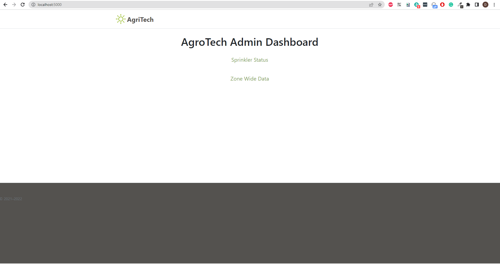
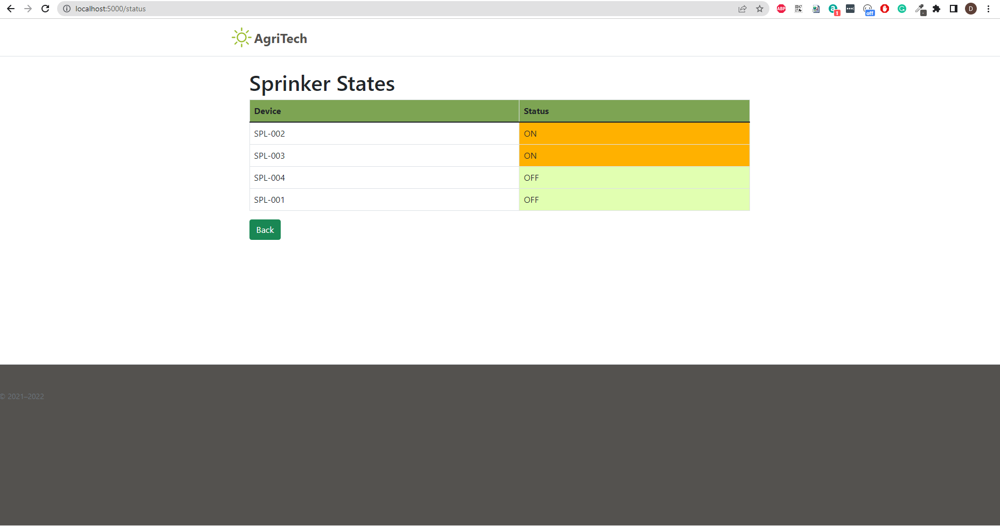
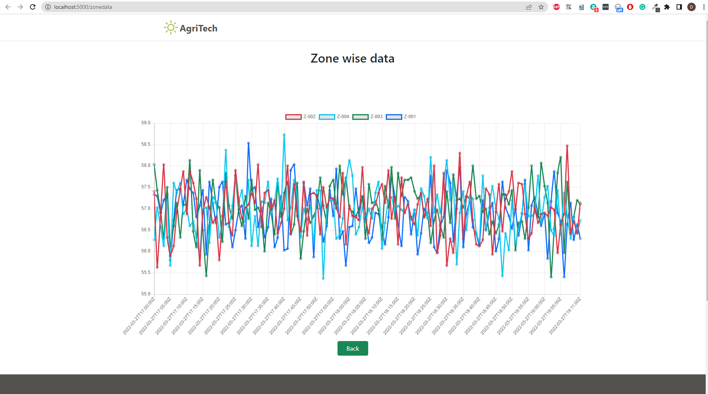

# Agritech Farm Water Management

## Architecture

## Instructions to Run the Project:
1. Unzip the IoT_FinalSubmission_Agritech_Group2_DeepakSubashiniNagashreeSriram.zip
2. Execute the Cloud Formation Command to create the Stack from the Agritech-main/config directory.
3. First create the stack using the template - Agritech_Farm_Role_Creation.template which will fail due to the Rules for IoT being added. Roll back the Stack and Delete the Stack by accpeting to leave the Roles created.
4. Next create the stack using the template - Agritech_Farm_Role_Resource_Creation.template which will create the Resources and the Services.
5. Through the console create a Thing and download the Device, Private, Public and the Root Certificate
6. Update the Certificate in the file mqtt_config.json in the Agritech_main/config folder and also update the host name in the same file.
7. Once this is done, then to start running the simulator go to the Agritech_main folder and execute the command python farm_manager.py
8. Also upload the zip file dep_package.zip into the lambda prior to running Step 7

## Design :

### Topic Structure design

To avoid overlap the communication is devided into 2 broad categoreies with 2 root level topics for _Soil Sensors_ and _Sprinklers_
* **sensor** (sensor/)
* **actuator** (actuator/)

#### Sensor communication

Sensor communication is devided into two types and are represented at level 2 of the sensor topic

* **Request** (sensor/request) and **Response** (sensor/response)
* **Telemetry data** (sensor/data)

Kepping the extensibility in mind each Request/Data type is named at 3nd level of the topic and the targeted device id at 4th level of topic for Response.

* Sensor Request
  * Register : Sensore makes the request to register itself
    * Topic :

            sensor/request/register
    * Payload

            {
                deviceId:<Device Id>,
                deviceType: <Device Type>,
                latitude:<Lattitude>,
                longitude:<Longitude>
                zoneId: <Zone Id>
            }
* Sensor Response
  * Register Response : Sensor receives response to its register request
      * Topic :

            sensor/response/register/deviceId
      * Payload

            {
                status : <REQUEST_SUCCESS / REQUEST_FAILED>
            }
* Sensor Data
    * Telemetry :
      * Topic :

              sensor/data/telemetry

      * Payload

              {
                  deviceId:<Device Id>,
                  deviceType: <Device Type>,
                  temperatur:<Temperatur>,
                  humidity:<Humidity>
              }

#### Sprinkler communication

Sprinkler communication is devided into two types and are represented at level 2 of the actuator topic
* **Request** (actuator/request) and **Response** (actuator/response)
* **Control Command** (actuator/command) and **Control Commmand responses** (acturator/command-response)

Kepping the extensibility in mind each Request/Response/Command type is named at 3nd level of the topic and the targeted zone id at 4th level of topic for Responses.

* Sprinkler Request
  * Register : Spinker makes requests to register itself
    * Topic :

            actuator/request/register
    * Payload

            {
                deviceId:<Device Id>,
                deviceType: <Device Type>,
                latitude:<Lattitude>,
                longitude:<Longitude>
                zoneId: <Zone Id>
            }

* Sprinkler Command
  * Set State : Sprinkler receives command
    * Topic :

            actuator/command/set-state/zoneId
    * Payload

            {
                state : <STATE_ON/STATE_OFF>
            }

* Sprinkler Response
  * Register Response: sprinkler receives the response to its register request
    * Topic :

            actuator/response/register/zoneId
    * Payload

            {
                status: <REQUEST_SUCCESS/REQUEST_FAILED>
            }

  * Set State Response: Sprinker responds with SUCCESS or FAILED to aws core for set state command
    * Topic :

            actuator/response/set-state/zoneId
    * Payload

            {
                status: <COMMAND_SUCCESS/COMMAND_FAILED>
            }

###  UI design

* Dashboard main page

* Sprinkler status page

* Zone data

#### Instructions to Run UI
* Run below from dashboard directory
        python run.py
